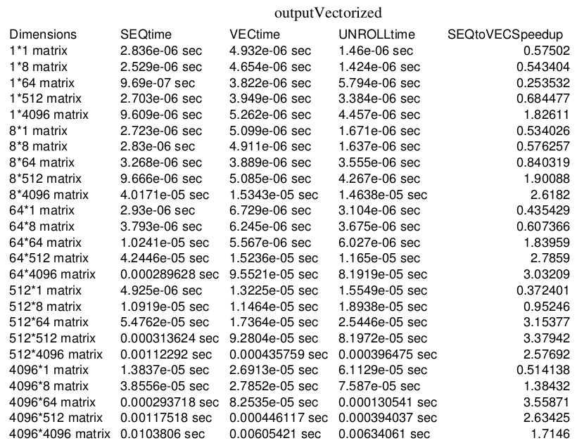

# SIMD-Matrix-Vectorization

# Dependencies / Installation

	Your CPU must support Intel AVX Intrinsics
	
# Running the Code

Compile:
	
	Run the compile_all.sh bash script from the source directory with
	
	sh compile_all.sh

Run:
	
	Run the tester_transpose.sh or tester_transpose_block.sh (or other) script from the source directory with
	
	sh tester_transpose_block.sh
	
	(This outputs a bunch of performance info in CSV format, which is 
	 available in a much more readable form in the Deliverables folder)
	 
	Note as well that this bash script is intended to be used with SLURM 

# Deliverables

See the PDFs in the Deliverables folder for data

The deliverables all show performance speedups on a local machine and performance speedups on a high performance
computing cluster (jobs run through SLURM)

Part 1:

	These deliverables track the speedups of cache blocking optimizations and the efficacy of
	the g++ -O2/-O3 optimization flags
	
Part 2:
	
	These deliverables track the speedups of vectorized/SIMD/Intel AVX Intrinsics optimizations and 
	also loop unrolling optimizations
